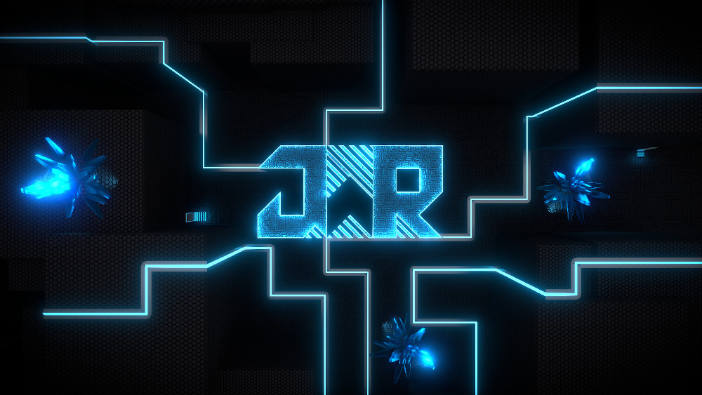
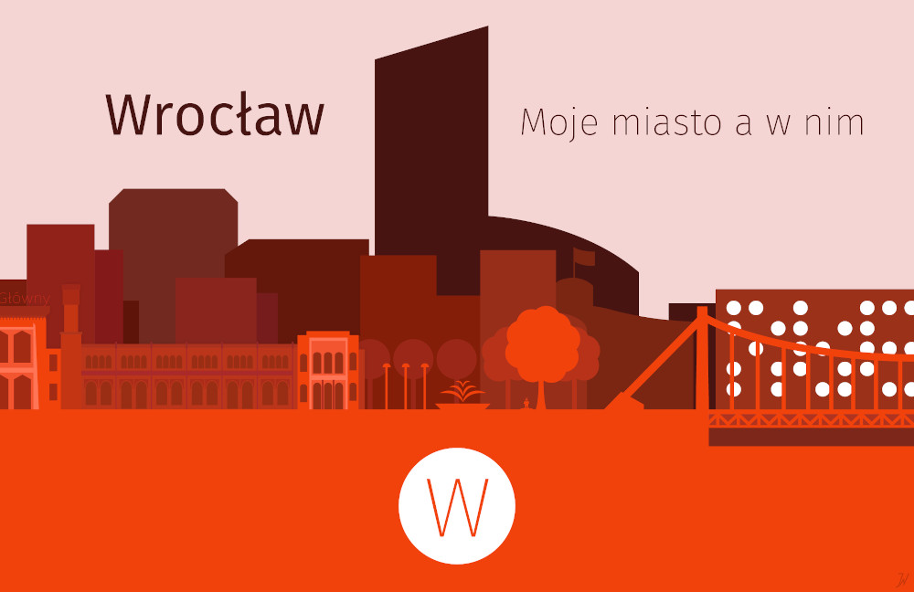

[github]: https://github.com/jerry-sky {target="_blank" rel="noopener"}
[yt]: https://www.youtube.com/channel/UCU3CxcihDdt75fV5jeODOEQ {target="_blank" rel="noopener"}
[twitter]: https://twitter.com/JerrySky27 {target="_blank" rel="noopener"}
[linkedin]: https://www.linkedin.com/in/jerzy-wroczy%C5%84ski-bb0333205/ {target="_blank" rel="noopener"}

<!-- the following line is dynamically replaced with actual SVG code containing the logo -->
===LOGO===

# Jerry Sky
*a.k.a. Jerzy Wroczyński, jwroczynski*

[ GitHub][github]
[ YouTube][yt]
[ Twitter][twitter]
[ LinkedIn][linkedin]

Stuff I’ve made

<main class="container">

[cv]: https://personal.jerry-sky.me/cv/curriculum-vitae.pdf {target="_blank" rel="noopener"}

## [Curriculum Vitae, CV][cv]

---

## Repository notebooks

[pn]: https://personal.jerry-sky.me/ {target="_blank" rel="noopener"}
[an]: https://academic.jerry-sky.me/ {target="_blank" rel="noopener"}

I store all my permanent notes in form of Markdown documents
which I keep in Git repositories.

- [Personal Notebook][pn] — personal notes on many things in my life
- [Academic Notebook][an] — academic notes taken during my C.S. studies

---

## Graphical Design

I do not have an extensive portfolio of artworks,
but I do love working in Blender 3D.\
Here are some artworks I’ve created:

- *Lightrunner, Tron: Legacy*

- *Wallpaper with my old logo in it*

- *Wrocław, graphical design competition*

---

## Other

[covoir]: https://covoir.jerry-sky.me {target="_blank" rel="noopener"}
[polaj]: https://polaj.jerry-sky.me {target="_blank" rel="noopener"}

- [*Covoir* — Covid-19 statistics app (a *Nokia Summer Trainee* recruitment project)][covoir]
- [*Polaj* — notatki z j. polskiego w liceum, notes on Polish literature course in High School][polaj]

</main>

<footer>

&copy; Jerry Sky, Jerzy Wroczyński, jwroczynski

</footer>
